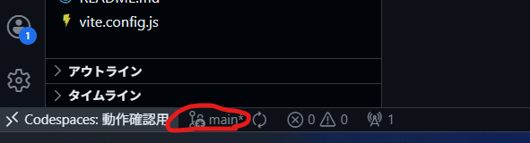
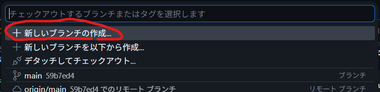
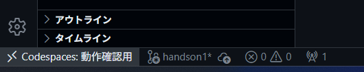
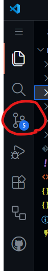
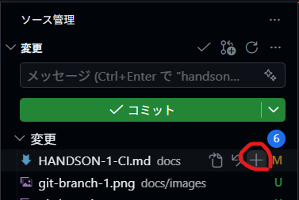
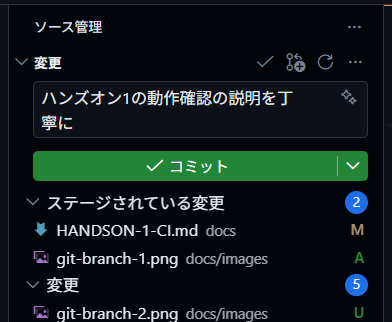
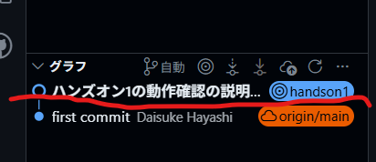
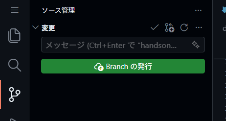

# ハンズオン 1: CI — PR 時の自動テスト

## ゴール

Pull Request を作成・更新したとき、自動的にテストが実行される GitHub Actions ワークフローを完成させる。

## やること

1. `docs/templates/workflows/ci.yml`を`.github/workflows/ci.yml`にコピーしてください。
2. ファイル内の以下のTODOを穴埋めしてください。

| TODO   | 埋める内容                                               |
| ------ | -------------------------------------------------------- |
| TODO-1 | `main`ブランチへのPR作成・更新時にアクションが起動させる |
| TODO-2 | リポジトリをチェックアウトする                           |
| TODO-3 | Node.js をセットアップする                               |
| TODO-4 | `npm ci`コマンドで依存パッケージをインストールする       |
| TODO-5 | `npm test`コマンドでテストを実行する                     |

## ヒント

<details>
<summary>ヒント 1: 構文について</summary>

GitHub Actions ワークフローの構文は以下の公式ドキュメントで確認できます。
- https://docs.github.com/ja/actions/reference/workflows-and-actions/workflow-syntax

</details>

<details>
<summary>ヒント 2: どのイベントを使うか</summary>

今回は PR 作成・更新時に動かしたいので、`on:` には `pull_request` を使います。

- https://docs.github.com/ja/actions/reference/workflows-and-actions/events-that-trigger-workflows#pull_request

</details>

<details>
<summary>ヒント 3: チェックアウトに使用するアクション</summary>

チェックアウトは `actions/checkout` を使います。

- https://github.com/actions/checkout

なお、`uses` の使い方は以下に記載されています。

- https://docs.github.com/ja/actions/reference/workflows-and-actions/workflow-syntax#jobsjob_idstepsuses

</details>

<details>
<summary>ヒント 4: Node のセットアップに使用するアクション</summary>

Node.js のセットアップは `actions/setup-node` を使います。

- https://github.com/actions/setup-node

なお、オプションは以下を指定してください。

```yml
with:
  node-version: "24.15.0"
  cache: "npm"
```

</details>

<details>
<summary>ヒント 5: シェルコマンドの実行方法</summary>

ステップで `run:` を使うとシェルコマンドを実行できます。

- https://docs.github.com/ja/actions/writing-workflows/workflow-syntax-for-github-actions#jobsjob_idstepsrun

</details>

> [!TIP]
> アクションをコミットハッシュで固定する</summary>
>
> セキュリティの観点から、アクションはコミットハッシュで固定することが推奨されます。  
> 今回は`pinact`というツールがインストールされているため、以下のコマンドで固定できます。
>
> ```sh
> pinact run .github/workflows/ci.yml
> ```

## 動作確認

1. gitブランチを作成

    画面左下のブランチ名の部分をクリック  
    

    「新しいブランチの」作成が選択されているのでEnter  
    

    任意のブランチ名を入力してEnter  
    

    画面左下のブランチ名が変わっていることを確認  
    

2. 変更をコミット

    左のメニュータブからソース管理を選択  
    

    変更したファイルを`+`ボタンをクリック  
    

    任意のコミットメッセージを入力してコミットボタンをクリック  
    

    コミットグラフに反映されていることを確認  
    

3. GitHub へプッシュ

    「Branchの発行」をクリック
    

    

4. GitHub 上で PR を作成
5. PR の「Checks」で CI が実行されることを確認する
6. CI が失敗するので、テストを修正して再度 PR を更新する
7. CI が成功することを確認する
